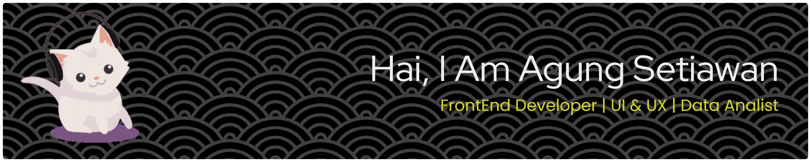

<h1 align="center">Hey 👋What's Up?</h1>

  

<h2>About Me</h2>

I'm a Frontend Web Developer who focuses on building modern, clean, and user-friendly web interfaces.

I enjoy turning UI/UX designs into interactive and responsive web pages that look great on both mobile and desktop devices.

  

#### Programming Language

#### Framework And Library

#### Tools

#### Database

#### 🚀 Projects I’ve Worked On  

| Project | Tech Stack | Description |
|--------|------------|-------------|
| **Contribution Graph Visualizer** |   | A custom GitHub contribution visualizer with dynamic rendering and profile branding animations. |
| **Personal Portfolio Platform** |   | A modern, fully responsive platform built with Next.js, featuring SEO optimization and reusable UI components. |
| **Core REST API Service** |   | Production-ready REST API using Laravel with authentication, authorization, and clean architecture principles. |
| **Inventory Management System** |   | A scalable inventory management system with relational data models and CRUD modules. |
| **Real-Time Chat Application** |   | A real-time communication service using Node.js and WebSocket technology with stable message delivery. |

#### GitHub Stats:
 
 

---

#### Play Games with me

<h2>🌟 Thank You for Visiting My GitHub! 🌟</h2>

  I'm really glad you're here!  
  Feel free to browse my repositories, explore my projects,  
  and see what I've been working on.  
  Your visit means a lot — thank you! ✨

